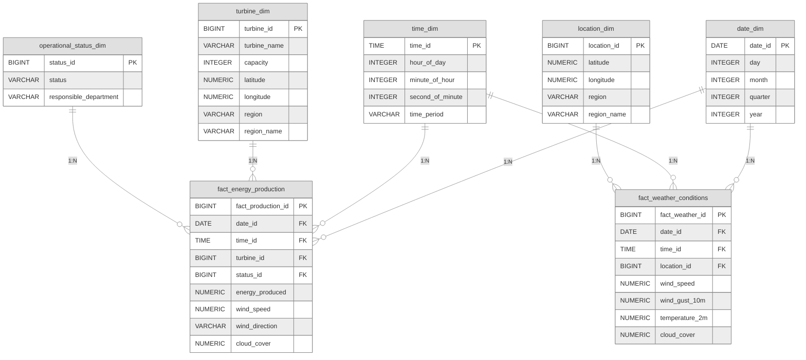

# Schéma en Étoile - Data Warehouse Gold Layer

## Diagramme Entité-Relations

## Description des Relations

### Tables de Dimension (5)

1. **date_dim** - Dimension temporelle (dates)
   - Clé primaire : `date_id` (date naturelle)
   - Contient les attributs calendaires

2. **time_dim** - Dimension temporelle (heures)
   - Clé primaire : `time_id` (heure naturelle)
   - Contient les attributs horaires

3. **turbine_dim** - Dimension des turbines
   - Clé primaire : `turbine_id` (clé stable générée par hash)
   - Contient les caractéristiques des turbines

4. **operational_status_dim** - Dimension des statuts opérationnels
   - Clé primaire : `status_id` (clé stable générée par hash)
   - Contient les statuts et départements responsables

5. **location_dim** - Dimension géographique
   - Clé primaire : `location_id` (clé stable générée par hash)
   - Contient les coordonnées et régions

### Tables de Faits (2)

1. **fact_energy_production** - Fait de production d'énergie
   - Mesure la production d'énergie par turbine
   - Dimensions : date, time, turbine, operational_status
   - Métriques : energy_produced, wind_speed_100m, wind_direction

2. **fact_weather_conditions** - Fait des conditions météorologiques
   - Mesure les conditions météo par localisation
   - Dimensions : date, time, location
   - Métriques : temperature_2m, pressure_msl, precipitation, wind_gust_10m, wind_speed_100m

## Cardinalités

- **1:N** (Un-à-Plusieurs) : Une ligne de dimension peut être référencée par plusieurs lignes de faits
- Chaque enregistrement de fait référence exactement une valeur par dimension (via FK)
- Les dimensions sont partagées entre les tables de faits (conformed dimensions)

## Clés

- **Clés naturelles** : date_dim (date), time_dim (heure)
- **Clés stables par hash** : turbine_dim, operational_status_dim, location_dim
  - Générées via `F.abs(F.hash(F.concat_ws()))` pour garantir la stabilité
 

